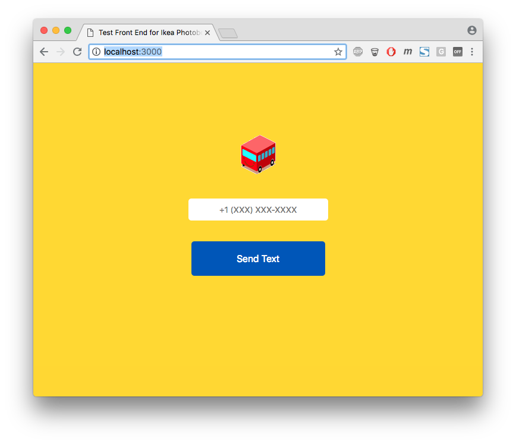

# Ikea Time Machine Server

NodeJS server for the Ikea Time Machine. This server provides an API endpoint for sending image data and phone number through AWS and Twilio to send an MMS message.

## Getting Started

These instructions will get you a copy of the project up and running on your local machine for development and testing purposes.


### Installing

First install the node modules

```
npm install
```

Then start the server

```
npm start
```

And that's it! There's a test page that should run on http://localhost:3000 and the server will be accessible from http://localhost:3002. The test page will allow you to test the service by sending a small base64 image to a number you specify.


## Test Page
Use this test page to test the service




## Endpoint Request Example

### API Resources

### POST /send-text

Example: Create – POST  http://localhost:3002/api/send-text

Request body:

    
        {
            "phoneNumber": "13015557165",
            "imgData": [formData]
        }
 


